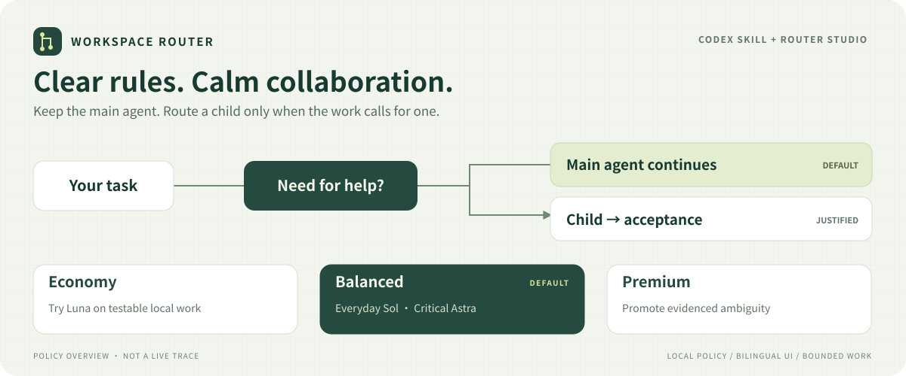

# Codex Workspace Router

**Keep everyday work direct. Give justified subagent work a clear model policy.**

**English** | [简体中文](README.zh-CN.md)

[](https://github.com/RyanGosling0508/codex-workspace-router/actions/workflows/validate.yml)
[](docs/installation.md)
[](LICENSE)

[Quick start](#quick-start) · [Presets](#three-presets) · [Documentation](docs/README.md) · [Contributing](CONTRIBUTING.md) · [Changelog](CHANGELOG.md)



A Codex Skill and local web console for deciding **when to delegate, which child model to use, and how much collaboration to allow**. Choose Economy, Balanced or Premium, inspect the decision in a simulator, and save the policy with a recoverable history.

**Balanced is the default.** Your selected main model stays in place. This project routes eligible subagents; it does not intercept every message or act as an API gateway.

## Why use it?

- **Fewer unnecessary handoffs.** Direct work comes first. Delegation needs an explicit request, a concrete independent review gap, or user-prioritized parallel speed.
- **Ready-made policies.** Three presets define task boundaries, model candidates, reasoning effort and ambiguity handling.
- **Try before applying.** A bilingual console shows draft changes and simulated route reasons, with backups when you save.
- **Fits existing projects.** Checks use the current host, file scope, shared resources and acceptance criteria; no automatic SSH synchronization.
- **Small local footprint.** Python standard library, no npm build and no separate router API key. The helper makes no model calls.

## Quick start

Requires Python **3.10+**, a Codex client that discovers the Skill, and selectable child models for model-specific delegation.

```sh
git clone https://github.com/RyanGosling0508/codex-workspace-router.git
cd codex-workspace-router
python -B install_router.py
python -B install_router.py --install
python -B run_console.py --installed --port 0 --open
```

Use `python3` on Linux/macOS. The first installer command previews changes; `--install` writes the Skill. Confirm **Balanced** and the installed file under **Policy source** in Router Studio. Choose **中 / EN** to switch languages.

Check that `workspace-router` appears in Codex's skill list, then start a new task. Try:

```text
$workspace-router Help me implement this feature. Keep unnecessary agent overhead low.
```

Ordinary work stays with the main agent. To try a child, explicitly request one bounded independent task; host and capability checks still apply.

Default install location: `$CODEX_HOME/skills/workspace-router` or `~/.codex/skills/workspace-router`. Client discovery conventions may differ. See [installation, alternate paths, SSH and upgrades](docs/installation.md). Existing installations with changes need a reviewed upgrade using `--replace`.

**Preview the console without installing:** `python -B run_console.py --port 0 --open` edits the repository sample policy. Use `--installed` to edit the installed Skill.

## Three presets

| Task | Economy | Balanced · default | Premium |
|---|---|---|---|
| Deterministic text extraction/transformation | Luna / High | Luna / High | Luna / High |
| Exact, low-risk local implementation with tests | Try Luna / High | Sol / Medium | Sol / High |
| Other routine work | Sol / Medium | Sol / Medium | Sol / High |
| Complex debugging and cross-component analysis | Sol / High | Sol / High | Astra / High |
| High-consequence decisions or open system design | Astra / High | Astra / High | Astra / XHigh |
| Evidenced ambiguity between adjacent lanes | Disable the lightweight trial | Highest established lane | Promote one lane |

Defaults: **one active child, two total starts, one diagnosed recovery, five minutes of reasoning work**. Presets never create a reason to delegate. Runtime availability and explicit user model choices still matter.

[Exact conditions, fallback order and evidence](workspace-router/references/presets.md) · [Task rubric](workspace-router/references/task-boundaries.md)

## How it works

1. **The main agent checks need.** Without a concrete delegation need, it continues directly.
2. **The helper checks supplied observations.** Host, paths, conflicts, budget and task evidence determine an eligible route.
3. **Codex dispatches when supported.** The actual collaboration tool must support the requested model and effort.
4. **The main agent checks acceptance.** A child finishing is not proof that its output is correct.

The Python helper is deterministic: no extra classifier model, background scheduler or automatic policy tuning. Implicit Skill selection is permitted, but not a guaranteed hook on every message. [Trigger examples](docs/usage.md)

## Documentation

| I want to… | Read |
|---|---|
| Install, upgrade, roll back or use SSH | [Installation](docs/installation.md) |
| Edit policies, simulate and restore history | [Router Studio](docs/console.md) |
| Understand automatic and explicit triggers | [Usage](docs/usage.md) |
| Understand model choices and evidence | [Presets](workspace-router/references/presets.md) |
| Fix discovery, model or policy problems | [FAQ](docs/faq.md) |
| Understand the implementation | [Architecture](docs/architecture.md) |
| Contribute or reproduce checks | [Contributing](CONTRIBUTING.md) |

## Boundaries and validation

This is an independent community project. It does not switch the current main model, supply browser/desktop tools, grant permissions, or deploy itself to remote hosts. API token prices do not establish subscription quota savings. Public evidence informs presets; routing tests do not prove model answer quality or the lowest total cost.

[Windows and Ubuntu CI](https://github.com/RyanGosling0508/codex-workspace-router/actions/workflows/validate.yml) checks routing, console behavior, installation and package links. See [what the tests cover](CONTRIBUTING.md#validation).

## Contribute

Bug reports, reproducible routing examples, translations and documentation fixes are welcome. Start with the [contribution guide](CONTRIBUTING.md), [report a bug](https://github.com/RyanGosling0508/codex-workspace-router/issues/new?template=bug_report.yml), or [propose an improvement](https://github.com/RyanGosling0508/codex-workspace-router/issues/new?template=feature_request.yml).

## Credits and license

Independent implementation informed by the workflow idea in [codex-auto-model-router](https://github.com/orange-the-weak/codex-auto-model-router); no router code or legacy agent presets were copied. [MIT License](LICENSE).
