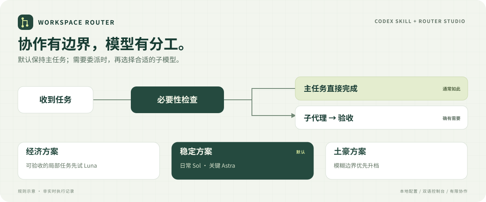

# Codex Workspace Router

**日常工作直接完成；需要子代理时，按明确规则选择模型。**

**[模型与路由科普](docs/model-guide.zh-CN.md)** — 官方定义、图解、分类反例与设计复核。

[English](README.md) | **简体中文**

[](https://github.com/RyanGosling0508/codex-workspace-router/actions/workflows/validate.yml)
[](docs/installation.zh-CN.md)
[](LICENSE)

[快速开始](#快速开始) · [三套预设](#三套预设) · [文档中心](docs/README.zh-CN.md) · [参与贡献](CONTRIBUTING.zh-CN.md) · [更新记录](CHANGELOG.md)



一个 Codex Skill，加一个本地网页控制台，用来管理**何时委派、子代理用什么模型、协作开销控制到什么程度**。选择经济、稳定或土豪方案，在模拟器中查看决策原因，再保存配置；旧版本可以恢复。

**默认使用稳定方案。** 当前主模型保持原样。本项目为符合条件的子代理分流，不会逐条拦截消息，也不是 API 网关。

## 它解决什么问题

- **减少不必要的交接。** 默认直接工作；明确要求、具体独立复核缺口或用户优先并行速度时，才考虑子代理。
- **不必从零调参数。** 三套预设覆盖任务分界、模型候选、推理强度和模糊边界处理。
- **修改前先看效果。** 双语控制台支持草稿模拟、决策原因、差异确认和保存备份。
- **适应现有项目。** 检查当前主机、文件范围、共享资源和验收标准；SSH 主机分别配置。
- **本地轻量运行。** Python 标准库，无需 npm 构建或单独的路由器 API Key；规则脚本不调用模型。

## 快速开始

需要 Python **3.10+**、能发现 Skill 的 Codex 客户端，以及支持选定子模型的代理工具。

```sh
git clone https://github.com/RyanGosling0508/codex-workspace-router.git
cd codex-workspace-router
python -B install_router.py
python -B install_router.py --install
python -B run_console.py --installed --port 0 --open
```

Linux/macOS 使用 `python3`。首次安装器命令只预览，`--install` 才写入。打开 Router Studio 后，确认选中**稳定方案**，并检查**配置来源**指向安装目录。右上角 **中 / EN** 切换语言。

确认 Codex 的 Skill 列表出现 `workspace-router`，再新建任务。可以这样试用：

```text
$workspace-router 帮我实现这个功能，减少不必要的代理开销。
```

普通任务仍由主模型完成。要试用子代理，可明确要求一个范围清楚的独立任务；实际派发仍需通过主机、范围和能力检查。

默认安装到 `$CODEX_HOME/skills/workspace-router` 或 `~/.codex/skills/workspace-router`。不同客户端的发现目录可能不同，详见[安装、其他路径、SSH 与升级](docs/installation.zh-CN.md)。已有且内容不同的安装需要审阅后使用 `--replace` 升级。

**只体验控制台、不安装 Skill：** 运行 `python -B run_console.py --port 0 --open`，编辑的是仓库示例配置；编辑已安装 Skill 时使用 `--installed`。

## 三套预设

| 任务 | 经济方案 | 稳定方案 · 默认 | 土豪方案 |
|---|---|---|---|
| 确定性文本提取 / 转换 | Luna / High | Luna / High | Luna / High |
| 精确、低风险、限定来源的只读事实核查 | Luna / High 先试 | Luna / High 先试 | Sol / High |
| 精确、低风险、有测试的局部实现 | 先试 Luna / High | Sol / Medium | Sol / High |
| 其他常规任务 | Sol / Medium | Sol / Medium | Sol / High |
| 复杂调试、跨组件分析 | Sol / High | Sol / High | Astra / High |
| 高影响决策、开放式系统设计 | Astra / High | Astra / High | Astra / XHigh |
| 有依据的相邻档位模糊 | 停用轻量试用 | 按已确认最高档 | 再升一级 |

统一默认：**同时 1 个子代理、累计 2 次启动、最多 1 次有依据的恢复、至少 5 分钟推理工作量**。选择预设不构成委派理由；实际模型可用性与用户明确指定仍需遵守。

[严格条件、回退顺序与实测依据](workspace-router/references/presets.zh-CN.md) · [任务分档规则](workspace-router/references/task-boundaries.zh-CN.md)

## 怎么运行

1. **主代理判断必要性。** 没有具体委派需要，就直接继续工作。
2. **脚本检查已有事实。** 主机、路径、冲突、预算和任务依据决定可选路线。
3. **Codex 在支持时派发。** 实际协作工具必须支持对应模型和推理强度。
4. **主代理检查验收。** 子代理结束不等于结果正确。

Python 脚本执行确定性规则，不额外启动分类模型，也没有后台调度或自动调参。Skill 允许隐式匹配，但不是每条消息必定执行的钩子。[查看触发示例](docs/usage.zh-CN.md)

## 文档导航

| 我想了解… | 文档 |
|---|---|
| 安装、升级、回滚、SSH | [部署指南](docs/installation.zh-CN.md) |
| 修改策略、模拟与恢复历史 | [控制台指南](docs/console.zh-CN.md) |
| 自动与显式触发 | [使用指南](docs/usage.zh-CN.md) |
| 模型选择与研究依据 | [预设详解](workspace-router/references/presets.zh-CN.md) |
| 发现不到 Skill、模型或配置异常 | [FAQ](docs/faq.zh-CN.md) |
| 实现结构与数据流 | [架构说明](docs/architecture.zh-CN.md) |
| 贡献代码、文档或复现实验 | [贡献指南](CONTRIBUTING.zh-CN.md) |

## 能力边界与验证

这是独立社区项目。它不切换当前主模型，不提供浏览器/电脑工具，不授予权限，也不自动部署到远端。API 标价不能直接折算订阅额度；公开实测为预设提供依据，规则测试不证明模型答案质量或最低总成本。

[Windows 与 Ubuntu CI](https://github.com/RyanGosling0508/codex-workspace-router/actions/workflows/validate.yml) 检查分流、控制台、安装与文档链接。详见[验证范围](CONTRIBUTING.zh-CN.md#验证)。

## 参与贡献

欢迎提交可复现问题、真实分流案例、翻译和文档改进。先阅读[贡献指南](CONTRIBUTING.zh-CN.md)，再[报告问题](https://github.com/RyanGosling0508/codex-workspace-router/issues/new?template=bug_report.yml)或[提出建议](https://github.com/RyanGosling0508/codex-workspace-router/issues/new?template=feature_request.yml)。

## 来源与许可

独立实现，工作流思路参考 [codex-auto-model-router](https://github.com/orange-the-weak/codex-auto-model-router)，未复制其路由代码或旧代理配置。[MIT 协议](LICENSE)。
