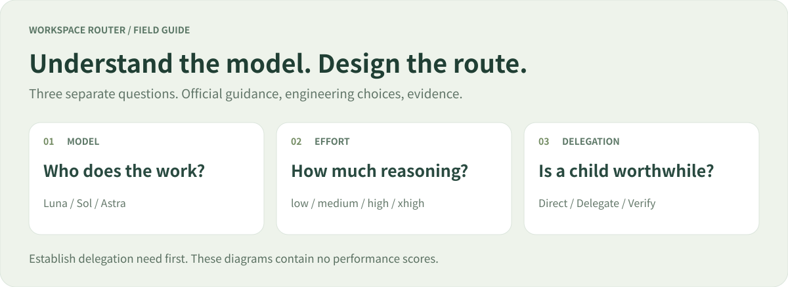
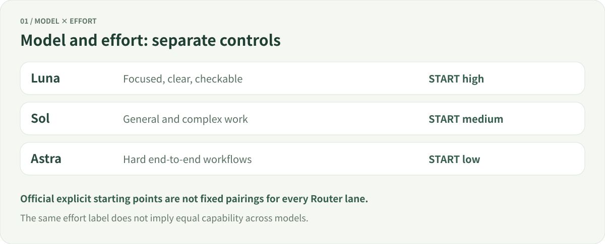
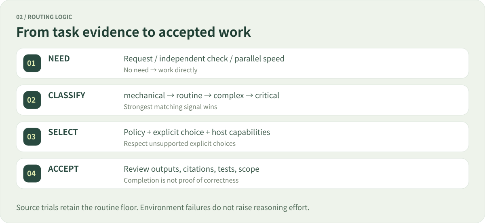

# Models, reasoning effort, and Router design

**English** | [简体中文](model-guide.zh-CN.md) · [Project home](../README.md) · [Documentation](README.md)

**Decide whether to delegate before selecting a model and effort.** This guide separates official definitions, project policy, and validation so every design choice can be traced.

Reviewed **2026-09-23** · Router **1.4.0** · Scope: GPT-6 Astra / Sol / Luna and Codex subagents. Availability varies with account, client, and rollout; the current runtime catalog takes precedence.

**Read through:** [Models](#1-official-model-roles) → [Effort](#2-what-reasoning-effort-means) → [Default picker](#3-default-and-recommended-models) → [Our rules](#4-translating-guidance-into-policy) → [Examples](#5-boundary-examples) → [Design review](#6-design-review-and-evidence) → [Sources](#7-original-sources-and-maintenance)

> [!NOTE]
> This is an independent project, not an official OpenAI Router. Its four lanes—mechanical, routine, complex, critical—are engineering categories, not official model tiers or benchmark scores.

## 1. Official model roles

| Model | Official positioning, summarized | Our interpretation | Unsupported inference |
|---|---|---|---|
| **GPT-6 Luna** | Efficient focused, high-volume work, including extraction, summaries, and focused coding | Candidate for bounded tasks with clear checks | Every short-looking request belongs here |
| **GPT-6 Sol** | Complex coding and agentic work | Starting point for ordinary implementation and many difficult subtasks | An everyday model cannot handle complexity |
| **GPT-6 Astra** | The most challenging reasoning and complete workflows | Preferred for high-consequence or open system work | Every small step should use the strongest model |

Positioning: [Luna](https://developers.openai.com/api/docs/models/gpt-6-luna), [Sol](https://developers.openai.com/api/docs/models/gpt-6-sol), [Astra](https://developers.openai.com/api/docs/models/gpt-6-astra). The last two columns are project interpretation.

The official subagent guide recommends starting most tasks with Sol and using Luna for lighter, narrow work. Suggested explicit starting efforts are **Sol medium, Luna high, Astra low**. These are starting points, not mandatory pairings. [Official subagent guidance](https://learn.chatgpt.com/docs/agent-configuration/subagents)

Luna is consequently not limited to string replacement. Focused coding and source checks can be suitable when completion is clearly verifiable. We introduce bounded trials before broadening policy.

## 2. What reasoning effort means

`reasoning.effort` guides reasoning investment. Actual work remains adaptive to the task; the setting is **not a fixed time, token allocation, or output-length control**. [Reasoning guide](https://developers.openai.com/api/docs/guides/reasoning)

| UI label | Configuration | Official guidance, summarized | Project use |
|---|---|---|---|
| Light / Low | `low` | Modest reasoning, favoring speed | Astra availability fallback in the mechanical pool |
| Medium | `medium` | Balance planning, judgment, and speed | Balanced routine Sol starting point |
| High | `high` | Complex reasoning, debugging, and deeper planning | Luna starting point; complex Sol; critical Astra |
| Extra High | `xhigh` | Deeper, longer work; justify overhead through evaluation | Selected fallback pools and Premium critical work |
| Max | `max` | More reasoning for the hardest problems | Never automatic; requires explicit request and runtime support |
| Ultra | Native workflow option | Subagents for separable complex work | A separately requested native workflow; no nesting inside Router children |

Effort semantics: [Reasoning guide](https://developers.openai.com/api/docs/guides/reasoning). UI labels and Max / Ultra: [Models](https://learn.chatgpt.com/docs/models). **Ultra is not a portable API `reasoning.effort` value.**

- **Luna high is not equivalent to Sol medium.** Starting recommendations do not establish a cross-model conversion. Higher effort does not change model identity.
- **Defaults need context.** The API defaults for Sol and Luna are medium; Codex's explicit configuration guidance suggests Luna high. API defaults, product Power starting presets, and project presets are different settings. [API defaults](https://developers.openai.com/api/docs/guides/reasoning)
- **More reasoning does not guarantee correctness.** Missing evidence, network failures, or permissions require their own remedy. Compare the same inputs and acceptance criteria before raising effort.

## 3. Default and recommended models

The official Models page lists these Power presets: **Luna High → Sol Light → Sol Medium → Astra Light → Astra Medium → Astra Extra High**. Starting presets and availability depend on product context. [Models](https://learn.chatgpt.com/docs/models)

This establishes curated **model/effort combinations**, not semantic classification and dispatch of every message. A read-only inspection of the local desktop client found that Default restores the recommended combinations, while an explicit model selects that model's effort options. This is a client-specific observation, **not a public guarantee about server internals**. The available evidence cannot exclude other backend scheduling.

| Dimension | Official picker / Power | Workspace Router |
|---|---|---|
| Target | Current task's model and effort configuration | A bounded subtask with an established delegation need |
| Input | User choice and product options | Coordinator-supplied evidence, scope, and runtime capabilities |
| Per-message difficulty analysis | Not established by the evidence here | No interception; Python does not classify natural language |
| Changes the main model | Managed by the product picker | No |
| Execution | Product runtime behavior | Python only advises; the coordinator uses real tools and permissions |

They can coexist: choose the main model in the product, then use Router when a child is justified.

## 4. Translating guidance into policy

### Delegation comes first

Direct work is the default. Proceed only for an **explicit delegation request, concrete independent read-only verification gap, or user-prioritized parallel speed**. Also require an independent boundary, sufficient context, acceptance criteria, available tools, and nonconflicting scope. Official guidance permits explicit requests or applicable project/skill instructions; this project defines narrower gates. [Official triggering guidance](https://learn.chatgpt.com/docs/agent-configuration/subagents)

One active child, two starts per user request, one diagnosed recovery, and a five-minute estimated reasoning threshold are **project overhead controls**. Five minutes is not a model thinking minimum or a request to wait. A ten-second lookup should stay local.

### Classify from evidence

The rubric uses task kind, specification, verification method, scope, input form, boundary, consequence, and uncertainty. It cannot establish that evidence text is true. The coordinator must validate it. Declared complexity is a floor; the strongest matching rule wins.

| Project lane | Boundary | Balanced first choice |
|---|---|---|
| **mechanical** | Extraction/transformation; exact specification; deterministic check; local text; low consequence and uncertainty—all required | Luna · high |
| **routine** | General implementation/research without a stronger signal | Sol · medium |
| **complex** | Cross-component/system scope, open specification, high uncertainty, or judgment-based debug/review/design | Sol · high |
| **critical** | High consequence; system scope with open specification/high uncertainty; or declared critical | Astra · high |

A model recommendation grants no execution permission and replaces no acceptance check. See [complete boundaries](../workspace-router/references/task-boundaries.md) and [implementation](../workspace-router/scripts/router.py).

### Presets and two bounded trials

| Situation | Economy | Balanced (default) | Premium |
|---|---|---|---|
| Strict mechanical | Luna high | Luna high | Luna high |
| Routine | Sol medium | Sol medium | Sol high |
| Complex | Sol high | Sol high | Astra high |
| Critical | Astra high | Astra high | Astra xhigh |
| Exact, local, low-risk implementation/debug with tests | Mechanical-pool trial | Routine pool | Routine pool |
| Exact, local, low-risk read-only source check | Mechanical-pool trial | Mechanical-pool trial | Sol high |
| Evidenced adjacent-lane ambiguity | Ordinary rules | Ordinary rules | One-lane promotion, capped at critical |

These are built-in settings; custom policies may differ. Both trials also require low uncertainty, text input, a clear boundary, and no failure recovery. Source checks additionally require `kind=research`, `verification=sources`, nonempty `source_evidence`, and no writes. **The lane stays routine; only the candidate pool changes.** Research is not relabeled mechanical.

Pools select the first **currently supported model/effort pair on the execution host**. For example, mechanical uses Luna high → Sol medium → Astra low. This is an availability fallback order, not three repeated attempts or a claim of quality equivalence. A diagnosed reasoning/verification failure in a trial recovers from routine to complex. Network/permission errors do not raise reasoning effort. Explicit model choices win; unsupported choices are reported. [Presets and fallback details](../workspace-router/references/presets.md)

## 5. Boundary examples

Assume delegation, scope, and runtime checks already pass; otherwise work stays with the coordinator.

| Apparently small task | Relevant evidence | Balanced result |
|---|---|---|
| Extract 200 fields using a fixed mapping | Deterministic comparison, local text, low risk | mechanical → Luna high |
| Verify a batch of defaults for a pinned SDK | Named official reference and declarations; per-fact citations and comparison | routine → eligible Luna high trial |
| Research the best architecture for our product | Open specification and tradeoffs | complex → Sol high |
| Resolve contradictory sources | Interpret conflicts, not merely collect citations; reflect uncertainty/judgment | Not a source trial; classify actual evidence |
| One-line cross-service auth fix | Cross-component scope; record high security consequence where present | High consequence → critical → Astra high |
| Single-file change without reliable checks | Judgment verification and honest uncertainty | Not deterministic mechanical or testable trial |
| Cannot reach the official website | Network/permission failure | Repair environment or report blocker, not model escalation |

A link alone does not establish `sources` verification. Specify **bounded sources, version, facts to check, and checking method**. Causal inference, design tradeoffs, or conflict resolution require honest judgment/uncertainty fields, not relabeling to reach a cheaper pool.

## 6. Design review and evidence

| Review question | Finding | Still unproven |
|---|---|---|
| Are model roles consistent? | Compatible with focused/general-complex/hardest-workflow positioning | The best model for every real project |
| Do effort starting points match? | Luna high and routine Sol medium follow explicit configuration guidance | Whether Astra high outperforms low enough on our critical tasks |
| Is Luna too restricted? | Bounded source trial added; Economy retains testable coding trial | Reliability for broader research/implementation |
| Is delegation excessive? | Necessity gate, budgets, and conflict checks remain | Optimal five-minute/two-start thresholds |
| Does source checking lower the lane? | Routine floor retained; admission, recovery, and explicit choices have regressions | Truth of source evidence and correctness of actual answers |
| Is console evidence wording current? | Corrected the caption: third-party evaluations are historical and not revalidated in this update | Applicability to the current release |
| Is this mislabeled intelligent routing? | Documentation separates coordinator judgment from deterministic Python | Unpublished official server routing |
| Does it overconstrain Astra? | Main-agent autonomy retained; this long guide is not mandatory runtime context | Real-task instruction overhead |

Official skill guidance recommends revisiting old scaffolding and avoiding overly prescriptive instructions for stronger models. We keep this explainer in user documentation, load runtime references as needed, and retain boundaries with concrete scope/permission/acceptance purposes. [Official skill-design article](https://developers.openai.com/blog/rethinking-skills-and-prompts-for-gpt-6-astra)

**The rules are compatible with cited positioning and have executable boundary checks. This does not establish optimal real-model quality or cost.** This review found no evidence justifying broad classifier relaxation or universal effort increases. Validation commands: [contributing](../CONTRIBUTING.md). Focused-source regressions: [test_source_checks.py](../workspace-router/tests/test_source_checks.py).

### How to measure actual benefit

Compare direct execution and proposed child routes on the same tasks, inputs, permissions, and acceptance criteria. Record quality, omissions, human corrections, total latency, combined parent/child usage, failure type, and recovery cost. Evaluate quality before cost. Record the actual execution model when observable; otherwise mark it unknown.

Simulator selections are not successful model evaluations. Counting only child tokens misses coordination costs. API prices do not directly describe subscription allowances. Change one boundary at a time, preserve a baseline, and rerun affected tasks before widening trials. [Evaluation protocol](../workspace-router/references/maintenance.md)

## 7. Original sources and maintenance

| Original source | Claims supported here |
|---|---|
| [Models — ChatGPT Learn](https://learn.chatgpt.com/docs/models) | Power presets, UI effort, Max and Ultra |
| [Subagents — ChatGPT Learn](https://learn.chatgpt.com/docs/agent-configuration/subagents) | Model/effort starting points, triggering, coordination overhead |
| [Reasoning models — OpenAI API](https://developers.openai.com/api/docs/guides/reasoning) | Effort semantics, API defaults, model-dependent values |
| [GPT-6 Luna](https://developers.openai.com/api/docs/models/gpt-6-luna) · [GPT-6 Sol](https://developers.openai.com/api/docs/models/gpt-6-sol) · [GPT-6 Astra](https://developers.openai.com/api/docs/models/gpt-6-astra) | Model positioning and API capabilities |
| [Rethinking skills and prompts for GPT-6 Astra](https://developers.openai.com/blog/rethinking-skills-and-prompts-for-gpt-6-astra) | Scope, progressive disclosure, avoiding excessive recipes |

On updates, check official pages, current runtime capabilities, and local rules together. Date revisions and preserve the distinction between official fact, project choice, and measured result. Original diagrams illustrate relationships, not measured performance ratios.

---

[Project home](../README.md) · [Console guide](console.md) · [Complete task boundaries](../workspace-router/references/task-boundaries.md)
