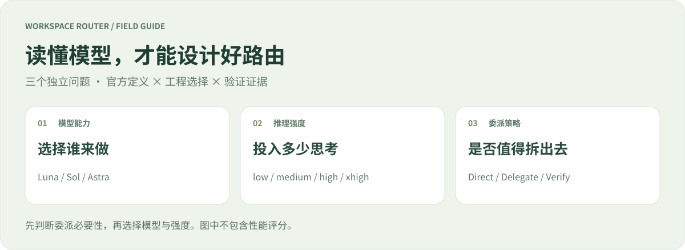
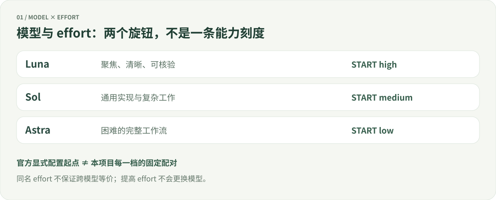

# 模型、推理强度与 Router 设计

[English](model-guide.md) | **简体中文** · [项目首页](../README.zh-CN.md) · [文档中心](README.zh-CN.md)

**先判断是否需要委派，再选择模型和推理强度。** 本页把官方定义、项目规则和验证结果分开陈述，方便追溯每一个设计选择。

核对日期：**2026-09-23** · 对应版本：**1.4.0** · 范围：GPT-6 Astra / Sol / Luna 与 Codex 子代理。账户、客户端和后续发布可能改变可用选项；运行时目录优先于本文。

**阅读路线：** [官方定义](#1-官方怎样区分模型) → [推理强度](#2-轻度中高极高究竟是什么) → [默认推荐模型集](#3-默认推荐模型集在做什么) → [分类规则](#4-我们怎样把定义变成规则) → [边界实例](#5-用反例吃透分类) → [设计复核](#6-这套设计经得起检查吗) → [原始资料](#7-原始资料与维护)

> [!NOTE]
> 本项目不是 OpenAI 官方 Router。`mechanical / routine / complex / critical` 是本项目的工作分类；它们不是官方模型等级，也不是能力测试分数。

## 1. 官方怎样区分模型

| 模型 | 官方定位的简要归纳 | 我们据此采用的角色 | 不能推出的结论 |
|---|---|---|---|
| **GPT-6 Luna** | 面向聚焦、高频任务的高效率模型，包括提取、摘要与聚焦编码 | 规格明确、边界小、容易核验的子任务候选 | “便宜，所以任何简单描述都交给它” |
| **GPT-6 Sol** | 面向复杂编码和 agent 工作的通用模型 | 常规实现与多数复杂子任务的起点 | “日常模型，所以不能做复杂工作” |
| **GPT-6 Astra** | 面向最具挑战性的推理与完整工作流 | 高后果、开放系统问题的优先候选 | “最强，所以应该处理每一个小步骤” |

定位来源：[Luna 模型页](https://developers.openai.com/api/docs/models/gpt-6-luna)、[Sol 模型页](https://developers.openai.com/api/docs/models/gpt-6-sol)、[Astra 模型页](https://developers.openai.com/api/docs/models/gpt-6-astra)。右侧两列是项目解释，不是官方承诺。

官方子代理指南建议：多数任务从 Sol 开始，轻量、窄范围任务可以用 Luna；明确设置时，可从 **Sol medium、Luna high、Astra low** 起步。这里的“起步”允许根据任务调整。[官方子代理指南](https://learn.chatgpt.com/docs/agent-configuration/subagents)

因此，Luna 并非只能做字符串替换；有清晰验收标准的聚焦编码、文档核查也可能适用。我们先开放可控试用范围，避免把模型定位直接扩张成未经验证的适用范围。

## 2. 轻度、中、高、极高究竟是什么

`reasoning.effort` 指导模型投入多少推理。它是相对的努力设置，模型仍会根据问题调整实际思考量；**不是固定秒数、固定 token 数，也不是回答字数开关**。[官方 reasoning 指南](https://developers.openai.com/api/docs/guides/reasoning)

| 常见界面名 | 配置值 | 官方含义的归纳 | 本项目的使用方式 |
|---|---|---|---|
| 轻度 / Light / Low | `low` | 较少推理投入，偏速度 | Astra 在机械候选链中的可用性回退 |
| 中 / Medium | `medium` | 平衡速度、规划与判断 | 稳定方案的常规 Sol 起点 |
| 高 / High | `high` | 更适合复杂推理、调试、深入规划 | Luna 起点；复杂 Sol、高后果 Astra |
| 极高 / Extra High | `xhigh` | 更深、更长的工作；应以评估收益证明额外开销 | 部分候选链及土豪关键档 |
| Max | `max` | 给最复杂问题更多推理空间 | 不自动选择；显式要求且运行时支持才可用 |
| Ultra | 原生工作流选项 | 使用子代理处理可分解的复杂工作 | 交给另行请求的原生流程；不在本 Router 子代理内嵌套 |

前五项依据 [reasoning 指南](https://developers.openai.com/api/docs/guides/reasoning)；界面名称、Max / Ultra 区别依据 [Models](https://learn.chatgpt.com/docs/models)。**Ultra 不能直接当作通用 API 的 `reasoning.effort` 值。**

三个常见误会：

- **Luna high 不等于 Sol medium。** 我们给出的起点是用途建议，没有跨模型等价公式。更高 effort 也没有换成另一款模型。
- **默认值需要说明语境。** API 的 Sol / Luna 默认 effort 为 medium；Codex 指南对显式配置建议 Luna high。API 默认、产品 Power 起点和项目预设是三件事。[API 默认说明](https://developers.openai.com/api/docs/guides/reasoning)
- **“多想”不保证更对。** 网络故障、权限不足、缺少材料，不会因升档自动消失。对合适任务再做相同输入和验收条件下的比较，才有调整依据。

## 3. “默认／推荐模型集”在做什么

官方 Models 页面列出的 Power 预设组合为：**Luna High → Sol Light → Sol Medium → Astra Light → Astra Medium → Astra Extra High**，并注明起始预设与可用项会受账户和客户端影响。[官方 Models](https://learn.chatgpt.com/docs/models)

这能证明产品提供了**模型与 effort 的预设组合**，不能单凭菜单证明“每条消息都经过语义难度判定并自动分发”。本次本地桌面客户端只读检查观察到：默认选项恢复推荐组合，指定模型后则使用该模型的 effort 选项。这是特定客户端的观察，**不是服务端实现的公开保证**；目前资料不足以断言后台绝无其他调度。

| 维度 | 官方选择器 / Power | Workspace Router |
|---|---|---|
| 主要对象 | 当前任务的模型与 effort 配置 | 已有委派理由的有界子任务 |
| 输入 | 用户选择与产品提供的选项 | 主代理提供的结构化任务证据、范围、运行时能力 |
| 是否判断每条消息难度 | 本页证据不足以作此断言 | 不拦截消息；脚本也不做自然语言分类 |
| 是否更换当前主模型 | 由产品选择器管理 | 不更换 |
| 是否自动执行 | 由产品运行机制决定 | Python 只给建议；主代理按真实工具和权限执行 |

两者可以配合：你在官方界面选主模型，Router 只在确实需要子代理时提供候选。

## 4. 我们怎样把定义变成规则

### 先过委派门槛

默认主代理直接工作。只有**明确委派请求、具体独立只读复核缺口、用户优先并行速度**之一成立，才继续检查。还必须有独立边界、完整上下文、明确验收、可用工具与无冲突的访问范围。官方允许显式请求或适用项目 / Skill 指令触发委派；本项目选择更具体的条件。[官方触发说明](https://learn.chatgpt.com/docs/agent-configuration/subagents)

默认一个活跃子代理、每次用户请求最多启动两个、一次已诊断恢复，以及五分钟预计推理工作门槛，**全部是项目的协作开销控制**。五分钟不是模型最低思考时间，也不要求人为等待；一个十秒能查清的事实应直接处理。

### 再按证据定档

规则读取任务种类、规格、验证方式、范围、输入形式、边界、后果和不确定性。它不理解证据文本的真假；主代理负责提供并核验。用户给出的复杂度是下限，强信号只能升档，最高命中规则生效。

| 项目分类 | 关键边界 | 稳定方案首选 |
|---|---|---|
| **机械 mechanical** | 提取 / 转换；精确规格；确定性校验；局部文本；低后果、低不确定性全部成立 | Luna · high |
| **常规 routine** | 未命中更高条件的一般实现或研究 | Sol · medium |
| **复杂 complex** | 跨组件 / 系统范围、开放规格、高不确定性，或依赖判断的调试 / 审查 / 设计 | Sol · high |
| **关键 critical** | 高后果；或系统范围同时规格开放 / 不确定性高；或显式声明关键 | Astra · high |

模型首选不代表允许执行敏感动作，也不替代人工或工具验收。完整可执行边界见 [分类说明](../workspace-router/references/task-boundaries.zh-CN.md) 与 [实现](../workspace-router/scripts/router.py)。

### 三套预设，以及两个受限试用

| 情况 | 经济 Economy | 稳定 Balanced（默认） | 土豪 Premium |
|---|---|---|---|
| 严格机械任务 | Luna high | Luna high | Luna high |
| 常规任务 | Sol medium | Sol medium | Sol high |
| 复杂任务 | Sol high | Sol high | Astra high |
| 关键任务 | Astra high | Astra high | Astra xhigh |
| 精确、局部、低风险、有测试的实现 / 调试 | 可试用机械候选池 | 保持常规候选 | 保持常规候选 |
| 精确、局部、低风险的限定来源只读核查 | 可试用机械候选池 | 可试用机械候选池 | 保持 Sol high |
| 有具体证据的相邻档模糊边界 | 按普通规则 | 按普通规则 | 再升一档，最高关键 |

以上为内置配置；自定义配置以实际值为准。两个试用均要求低不确定性、文本输入、清晰边界、没有失败恢复；来源核查还要求 `kind=research`、`verification=sources` 和非空 `source_evidence`，写任务不准进入该试用。**试用仍保留 routine 分类，只换候选池**，不会把研究重新命名为机械工作。

候选池按顺序找**当前主机支持的模型 / effort 组合**。例如机械池是 Luna high → Sol medium → Astra low。这是可用性回退顺序，不是同一任务轮流跑三遍，也不是质量等价关系。若 trial 出现已诊断的推理 / 验证失败，恢复从保留的 routine 升到 complex；网络 / 权限错误不触发推理升档。显式模型选择优先，不能满足时报告不支持。[预设与回退](../workspace-router/references/presets.zh-CN.md)

## 5. 用反例吃透分类

下面假设已经满足委派、范围和运行时检查；否则仍由主代理处理。

| 同样看起来“小”的工作 | 应提供的证据 | 稳定方案结论 |
|---|---|---|
| 按固定映射提取 200 条字段 | 确定性逐条比对、局部文本、低风险 | mechanical → Luna high |
| 核对一组已锁定 SDK 版本的默认参数 | 指定官方参考与声明位置，能逐项引用比对 | routine → 可试用 Luna high |
| “研究哪种架构最适合我们” | 开放方案、需要权衡 | complex → Sol high |
| “这些来源互相冲突，判断谁对” | 解释冲突，不能只收集引用；通常需要更高不确定性或判断验证 | 不满足来源试用；按实际证据归类 |
| 一行代码的跨服务鉴权修复 | 范围跨组件；若安全后果高，明确记录 | 高后果时 critical → Astra high |
| 单文件改动但没有可靠验收方式 | `verification=judgment`，说明不确定性 | 不能进入确定性机械档或测试试用 |
| 无法访问官网 | 实际错误为网络 / 权限 | 修环境或报告阻塞；不会因错误直接升级模型 |

“有链接”不等于 `sources` 验证：必须说明**来源范围、版本、待核事实和检查方法**。如果答案需要因果推断、架构权衡或解决矛盾，应如实填写判断与不确定性，而不是为了进低档而换标签。

## 6. 这套设计经得起检查吗

### 本次设计复核结论

| 检查点 | 结论与依据 | 尚未证明的部分 |
|---|---|---|
| 模型职责分工 | 与官方的聚焦 / 通用复杂 / 最难工作流定位相容 | 每一种真实项目的最优模型 |
| effort 起点 | Luna high、常规 Sol medium 对齐官方显式配置建议 | Astra high 是否比 low 在我们的关键任务更划算 |
| Luna 是否限制过严 | 新增限定来源试用；经济方案保留可测试编码试用 | 更大规模研究或实现是否也能稳定交给 Luna |
| 是否过度拆分 | 先判断委派必要，预算和冲突检查继续有效 | 默认五分钟与两个启动预算的最优性 |
| 来源核查是否降格 | routine 下限保留；所有准入条件、恢复和显式选择均有回归覆盖 | 来源文本真实、引用完整和模型答案正确 |
| 控制台依据是否过时 | 修正了旧文案：第三方评测明确标为历史参考、本次未复核 | 第三方结果能否推广到当前版本 |
| 是否误称自动智能路由 | 文档明确：主代理评估，Python 执行确定性规则 | 官方服务端未公开的调度机制 |
| 是否过度约束 Astra | 主代理保留自主执行；本页不强制加载进每次 Skill 上下文 | 仍需实际任务衡量指令开销 |

官方也建议新模型发布后精简 Skill，避免把适合较小模型的步骤机械套给 Astra。因此我们将长篇科普留在用户文档，运行时只按需读取相关规则，保留有实际作用的权限、范围和验收边界。[官方 Skill 设计文章](https://developers.openai.com/blog/rethinking-skills-and-prompts-for-gpt-6-astra)

**结论：当前规则与引用的官方定位相容，边界有可执行测试；不能据此宣称配置已经过真实模型质量或成本最优化。** 本次复查未发现需要放宽整个分类器的证据，也没有为了“更新”而普遍升档。测试入口见 [贡献指南](../CONTRIBUTING.zh-CN.md)，来源试用回归见 [test_source_checks.py](../workspace-router/tests/test_source_checks.py)。

### 下一步怎样验证真正的收益

用同一任务集、同一输入材料、工具权限和验收标准，分别比较主代理直接做与对应子代理路线。记录完成质量、遗漏、人工修正、总延迟、主代理加子代理的总用量、失败类型和恢复成本。先评质量，再比较成本；记录实际运行模型，无法观测时标为未知。

不要用模拟器命中某个模型作为成功样本；不要只计算子代理 token；不要将 API 单价直接换算为订阅额度。调整一条边界后，保留基线并复测受影响任务，再决定是否扩大试用。[评估维护协议](../workspace-router/references/maintenance.md)

## 7. 原始资料与维护

| 原始资料 | 本页用来支持什么 |
|---|---|
| [Models — ChatGPT Learn](https://learn.chatgpt.com/docs/models) | Power 预设、界面 effort、Max 与 Ultra |
| [Subagents — ChatGPT Learn](https://learn.chatgpt.com/docs/agent-configuration/subagents) | 模型与 effort 起点、触发、协作开销 |
| [Reasoning models — OpenAI API](https://developers.openai.com/api/docs/guides/reasoning) | effort 含义、API 默认、支持值依模型而异 |
| [GPT-6 Luna](https://developers.openai.com/api/docs/models/gpt-6-luna) · [GPT-6 Sol](https://developers.openai.com/api/docs/models/gpt-6-sol) · [GPT-6 Astra](https://developers.openai.com/api/docs/models/gpt-6-astra) | 各模型定位与 API 能力 |
| [Rethinking skills and prompts for GPT-6 Astra](https://developers.openai.com/blog/rethinking-skills-and-prompts-for-gpt-6-astra) | 适用范围、渐进阅读、避免过度步骤化 |

更新时同时核对官方页面、当前运行时能力与本地规则；标注日期，保留“官方事实 / 项目选择 / 实测结果”的区别。本文原创示意图用于解释关系，不表示测得的性能比例。

---

[回到项目首页](../README.zh-CN.md) · [打开控制台指南](console.zh-CN.md) · [查看完整任务边界](../workspace-router/references/task-boundaries.zh-CN.md)
